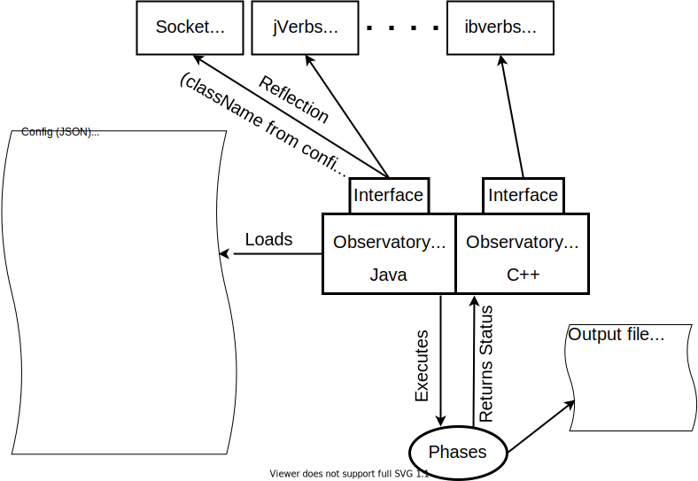

# Observatory

  

  
  
  
  

## Introduction

Observatory is an extensible Java framework for benchmarking InfiniBand verbs implementations. It is being developed as a research project by the [Operating Systems group](https://www.cs.hhu.de/en/research-groups/operating-systems.html) at the *Heinrich Heine University Düsseldorf*.

  

It is intended to benchmark fundamental point-to-point connections by measuring uni- and bidirectional throughput, one-sided latency and full round-trip time. It also uses the [jDetector](https://github.com/hhu-bsinfo/jdetector) library to determine the data overhead, imposed by any software defined protocol.

Observatory provides a single lean interface, that combines messaging, as well as RDMA operations, so that implementations for different libaries can easily be developed. To configure a set of benchmark runs, a JSON file can be used.

## Architecture

  

The benchmark itself is made up of six phases that are executed consecutively:

 1. **Initialization**: During this phase, the client should allocate any needed resources (e.g open an IB context and allocate a Protection Domain). Client-specific configuration parameters, that are defined in the configuration file (JSON), are passed to the client as key-value tuples. This can be used to pass IB related parameters to the client (e.g. the device and port number).
 2. **Connection**: A connection is setup, after IB connection information has been exchanged (e.g. via TCP sockets).
 3. **Preparation**: The operation size, which dictates the size of the messages being sent, respectively the size of RDMA writes/reads being performed, is passed to the client, allowing it to allocate matching buffers to use in the benchmark. It is also reasonable to preallocate reusable Work Requests during this phase.
 4. **Warmup**: A configurable amount of operations are executed as a warmup, allowing the JVM and its JIT to optimize the benchmark code.
 5. **Operation**: This is the main phase of the benchmark, executing the configured amount of operations. If a bidirectional benchmark run is performed, dedicated threads for sending and receiving are started. If a throughput benchmark is being performed, two timestamps will be taken right before the first operation starts and right after the last one has finished. Otherwise, if a latency measurement is performed, the time needed for each operation is measured and stored in an array. This allows calculating percentiles afterwards. Furthermore, the benchmark utilizes the performance counters of the IB HCA to determine the raw amount of data being sent/received. Thus, it is possible to calculate the overhead added by any software defined protocol which is especially relevant for the socket-based libraries.
 6. **Cleanup**: The benchmark is finished, resources shall be freed and all connections shall be closed.
  
Observatory currently provides Java implementations for TCP-Sockets, [jVerbs](https://www.ibm.com/support/knowledgecenter/en/SSYKE2_7.1.0/com.ibm.java.lnx.71.doc/diag/understanding/rdma_jverbs.html), [DiSNI](https://developer.ibm.com/technologies/analytics/projects/direct-storage-and-networking-interface-disni/), [JUCX](https://www.openucx.org/) and [neutrino](https://www.cs.hhu.de/en/research-groups/operating-systems-prof-dr-michael-schoettner/research/neutrino.html), as well as native implementations for TCP-Sockets and [libibverbs](https://github.com/linux-rdma/rdma-core).

## Publications

 - *Performance analysis and evaluation of Java-based InfiniBand solutions*, Fabian Ruhland, Filip Krakowski, Michael Schöttner, to appear in: Proceedings of the IEEE International Symposium on Parallel and Distributed Computing ([ISPDC](https://ispdc2020.ipipan.waw.pl/)), Warsaw, Poland, 2020.
